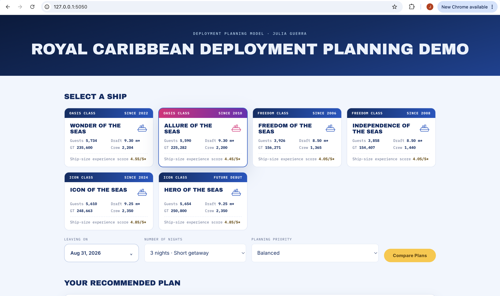
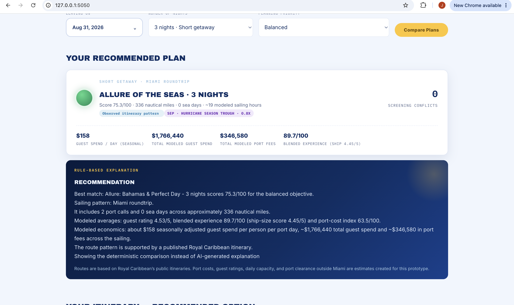
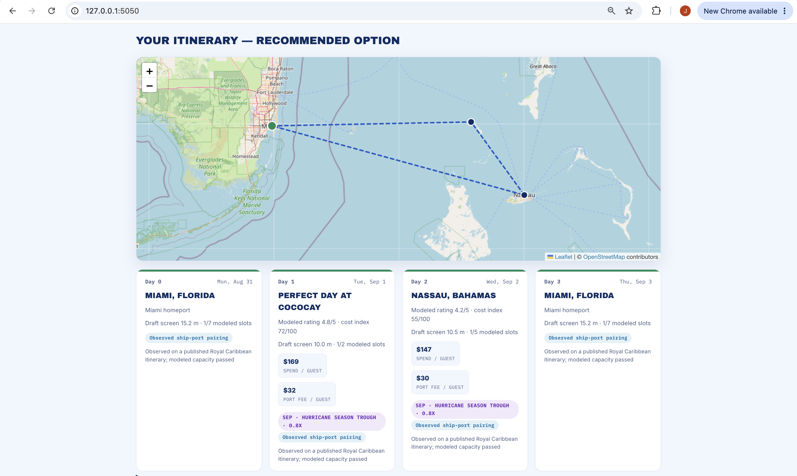
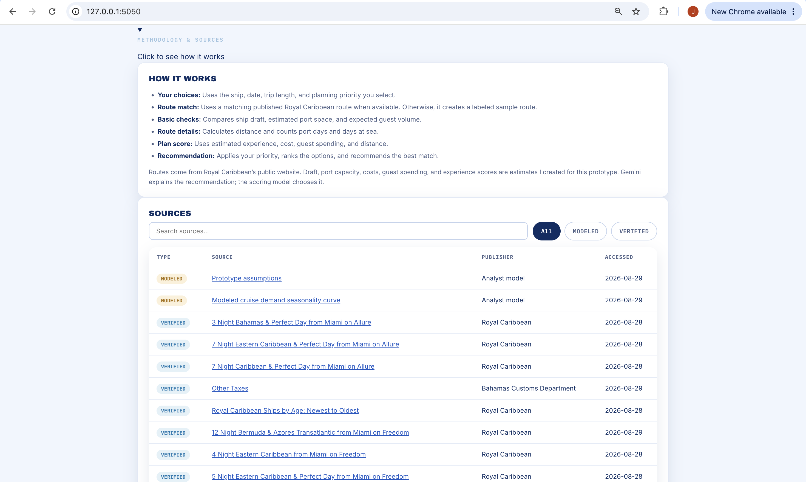

# RC_Deployment_Planner

## How It Looks
 
**1. Select a ship, sailing date, trip length, and planning priority. Each ship card shows key specs at a glance: guest capacity, gross tonnage (GT), draft, crew size, and a ship-size experience score.**
 

 
**2. The model scores the top match and explains why. Including cost, guest spend, and experience score. It also factors in seasonality, adjusting guest spend up or down depending on the time of year. It can explain the recommendation using either a rule-based approach or AI (Gemini). Every result is labeled as either verified (sourced from published data) or modeled (an estimate), so it's always clear what's backed by a real source vs. what should be treated as an approximation.**
 

 
**3.The recommended itinerary shows up on a map with the exact geographic route the trip follows, along with a day-by-day breakdown of ports, spend, and fees.**
 

 
**4. The methodology panel shows what's verified vs. modeled, with links to sources.**
 

 
